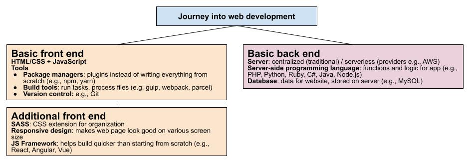

# web development tutorials
Accumulative knowledge base for personal web-dev learning

## beginner's web development outline

## relevant tutorials (source: youtube, etc.)
1. completed [Learn web development as an absolute beginner](https://www.youtube.com/watch?v=ysEN5RaKOlA&list=PLlDtQmr6nZSY90W9SYNw4k_Jv--mSzt0z&index=35)
2. completed [Learn HTML & CSS in 2022 | Crash Course](https://www.youtube.com/watch?v=gXLjWRteuWI&t=960s)
3. [BEST JavaScript Tutorial for Beginners for Getting a Job 2021 (High Quality, Project Based Course)](https://www.youtube.com/watch?v=DqaTKBU9TZk)
