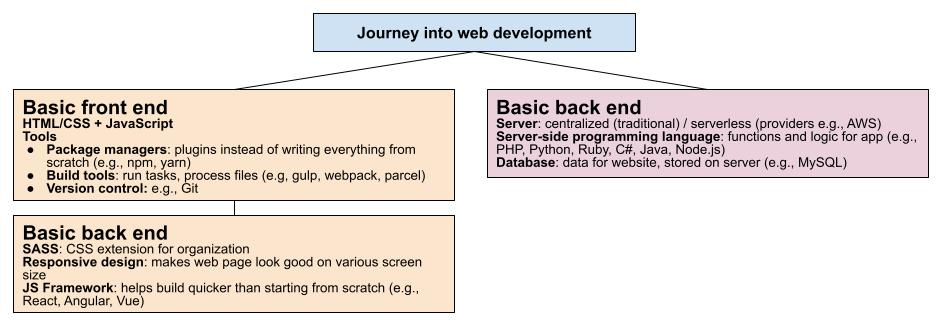

# Web development tutorials
Accumulative knowledge base for personal web-dev learning (things worth noting)

## featured tutorials (source: Youtube, etc.)
* [Learn web development as an absolute beginner](https://www.youtube.com/watch?v=ysEN5RaKOlA&list=PLlDtQmr6nZSY90W9SYNw4k_Jv--mSzt0z&index=35)
* [BEST JavaScript Tutorial for Beginners for Getting a Job 2021 (High Quality, Project Based Course)](https://www.youtube.com/watch?v=DqaTKBU9TZk)

